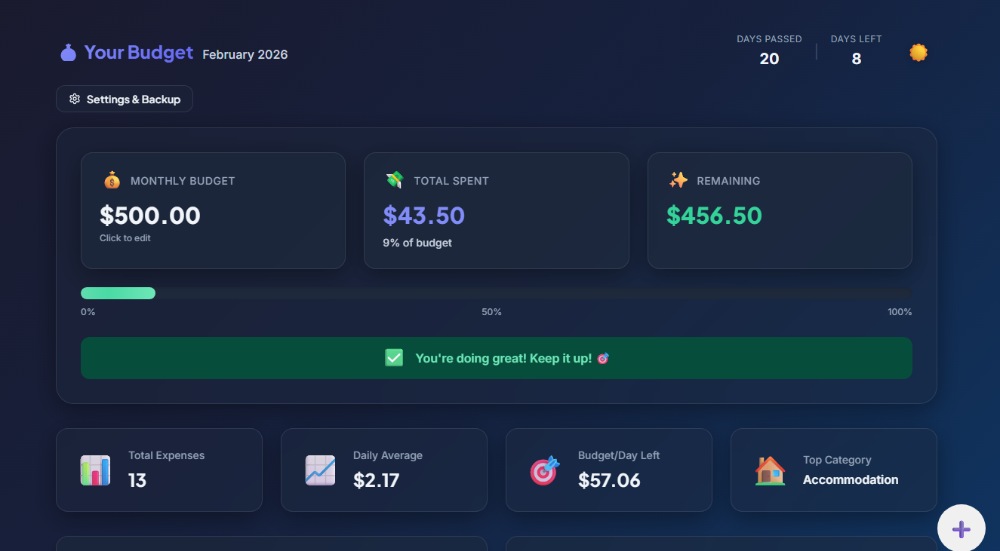
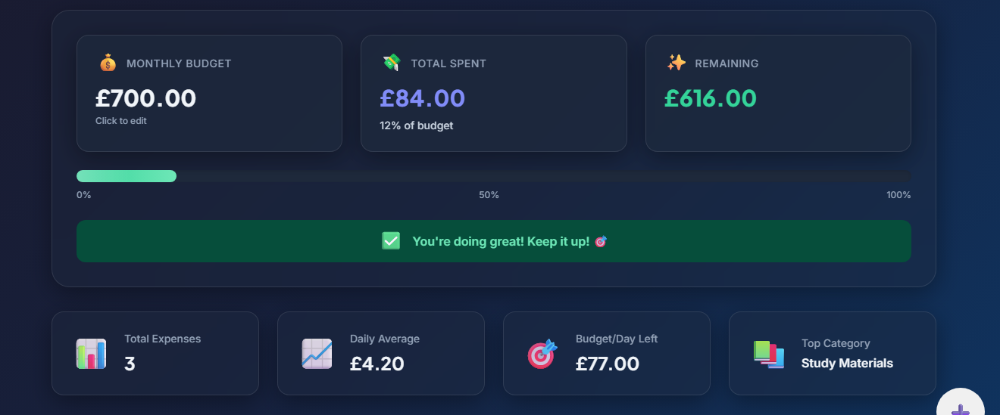
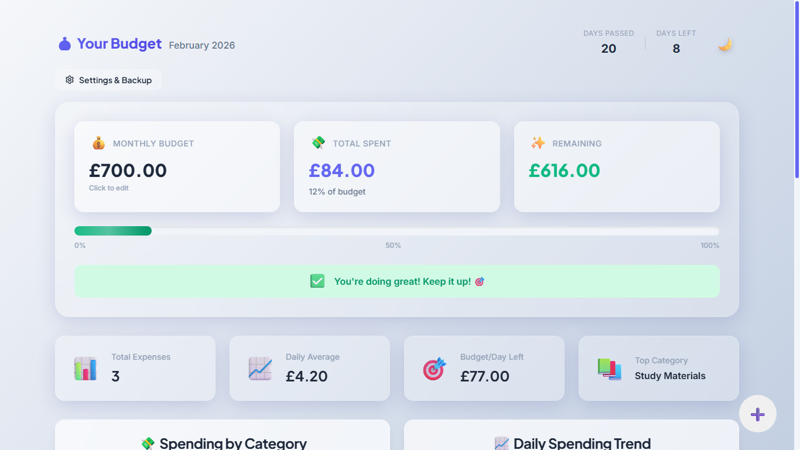
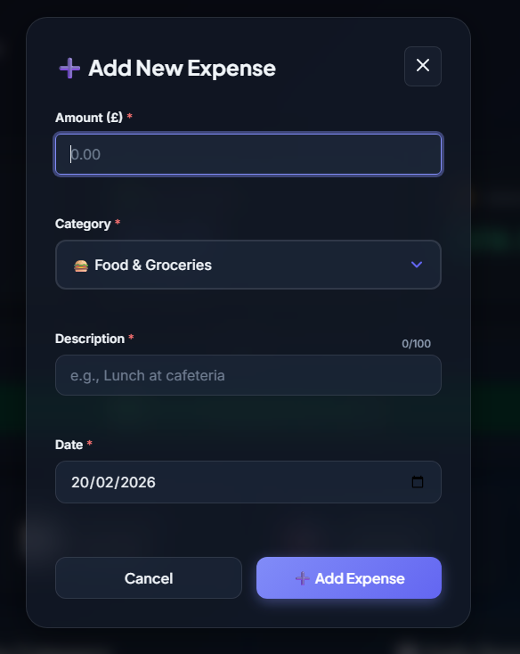
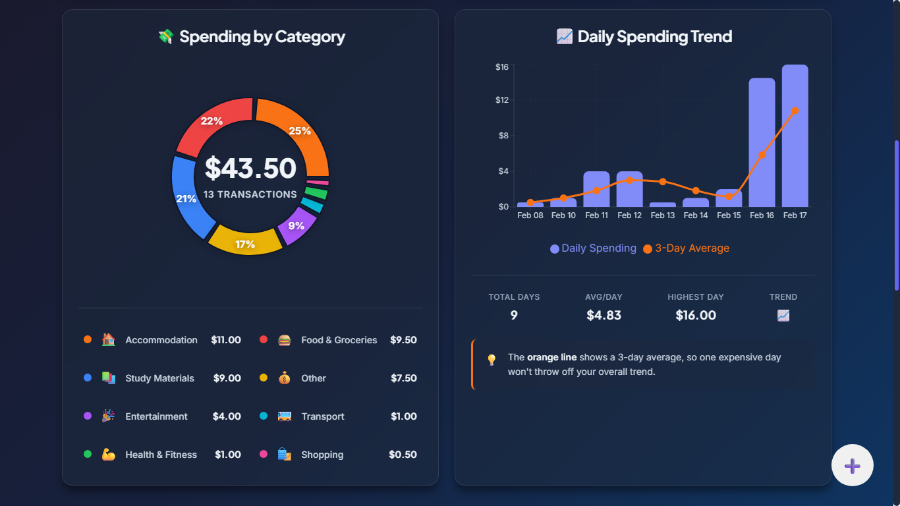
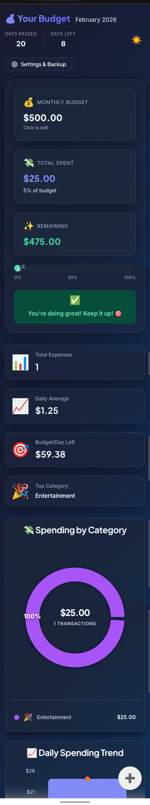
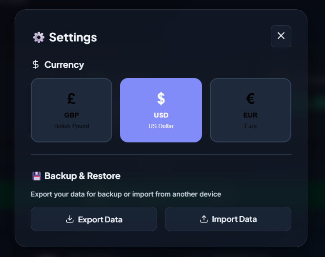

# 💰 Student Budget Planner

A beautiful, intuitive budget tracking application designed specifically for students. Track expenses, visualize spending patterns, and stay on top of your finances with ease.

<p align="center">
  <a href="https://studentbudgetplana.netlify.app/" target="_blank" rel="noopener noreferrer">
    
  </a>
</p>

<p align="center" style="margin: -10px 0 30px 0; font-size: 1.1em; font-weight: 500; color: #555;">
  Experience the Student Budget Planner instantly — no sign-up, no install
</p>



## ✨ Features

### 💸 Expense Management
- **Quick Entry**: Add expenses in seconds with an intuitive form
- **Full Control**: Edit or delete any expense with ease
- **Smart Categories**: 8 pre-defined categories with emoji indicators
- **Date Tracking**: Record expenses with specific dates

### 📊 Visual Insights
- **Spending Breakdown**: Beautiful pie chart showing expenses by category
- **Trend Analysis**: Bar chart displaying daily spending patterns
- **Real-time Stats**: Track total expenses, daily averages, and remaining budget

### ⚠️ Budget Alerts
- **Traffic Light System**: Visual warnings when approaching budget limits
  - 🟢 Green: Under 70% of budget (safe)
  - 🟡 Yellow: 70-85% of budget (caution)
  - 🔴 Red: Over 85% of budget (warning)
- **Progress Bar**: Clear visualization of budget usage
- **Smart Messages**: Contextual feedback based on spending habits

### 🌍 Multi-Currency Support
- British Pound (£)
- US Dollar ($)
- Euro (€)

### 🎨 Themes
- **Light Mode**: Clean, bright interface for daytime use
- **Dark Mode**: Easy on the eyes for evening budgeting
- **Smooth Transitions**: Seamless switching between themes

### 💾 Data Management
- **Export**: Download your data as JSON for backup
- **Import**: Restore data on any device
- **Local Storage**: All data stays on your device - completely private

### 📱 Responsive Design
- Works flawlessly on desktop, tablet, and mobile
- Touch-optimized interactions
- Adaptive layouts for all screen sizes

---

## 🖼️ Screenshots

### Dashboard Overview
*Main dashboard showing budget summary, spending insights, and charts*



### Light Theme
*Clean, bright interface perfect for daytime use*



### Add Expense
*Quick and intuitive expense entry form*



### Spending Charts
*Visual breakdown of spending by category and daily trends*



### Mobile View
*Fully responsive design that works on any device*



### Settings
*Currency selection and data backup options*



---

## 🚀 Getting Started

### Prerequisites
- Node.js (v16 or higher)
- npm or yarn

### Installation

1. **Clone the repository**
```bash
   git clone 
   cd student-budget-planner
```

2. **Install dependencies**
```bash
   npm install
```

3. **Start the development server**
```bash
   npm run dev
```

4. **Open your browser**
   Navigate to `http://localhost:3000`

### Building for Production
```bash
npm run build
```

The production-ready files will be in the `dist` folder.

---

## 🛠️ Built With

- **React 18** - UI framework
- **Vite** - Build tool and development server
- **Framer Motion** - Smooth animations and transitions
- **Recharts** - Beautiful, responsive charts
- **date-fns** - Date formatting and manipulation
- **Lucide React** - Modern icon library

---

## 📂 Project Structure
```
student-budget-planner/
├── public/
│   └── index.html
├── src/
│   ├── components/
│   │   ├── Dashboard/          # Main dashboard component
│   │   ├── BudgetSummary/      # Budget cards and progress bar
│   │   ├── BudgetModal/        # Budget editor modal
│   │   ├── ExpenseForm/        # Add/edit expense form
│   │   ├── ExpenseList/        # Expense list with pagination
│   │   ├── Charts/             # Pie and bar charts
│   │   └── Settings/           # Settings and backup modal
│   ├── hooks/
│   │   └── useTheme.js         # Theme management hook
│   ├── utils/
│   │   ├── constants.js        # App constants and categories
│   │   ├── localStorage.js     # Data persistence functions
│   │   └── calculations.js     # Budget calculations
│   ├── styles/
│   │   ├── variables.css       # CSS custom properties
│   │   └── global.css          # Global styles
│   ├── App.jsx                 # Root component
│   └── main.jsx                # Entry point
├── package.json
└── README.md
```

---

## 💡 Usage Guide

### Setting Your Budget
1. Click on the **Monthly Budget** card
2. Enter your desired budget amount
3. Click **Save Budget**

### Adding an Expense
1. Click the **+** button (bottom-right corner)
2. Fill in the amount, category, description, and date
3. Click **Add Expense**

### Editing an Expense
1. Find the expense in the list
2. Click the **pencil icon**
3. Make your changes
4. Click **Update**

### Deleting an Expense
1. Find the expense in the list
2. Click the **trash icon**
3. Confirm deletion

### Changing Currency
1. Click **Settings & Backup** button
2. Select your preferred currency (GBP, USD, or EUR)
3. The page will reload with your new currency

### Backing Up Your Data
1. Click **Settings & Backup** button
2. Click **Export Data**
3. Save the JSON file to a safe location

### Restoring Data
1. Click **Settings & Backup** button
2. Click **Import Data**
3. Select your previously exported JSON file

### Switching Themes
- Click the sun ☀️ or moon 🌙 emoji in the top-right corner

---

## 🎨 Design Philosophy

### Color-Coded Categories
Each expense category has a unique color for easy visual identification:
- 🍔 Food & Groceries (Red)
- 🚌 Transport (Teal)
- 📚 Study Materials (Blue)
- 🏠 Accommodation (Salmon)
- 🎉 Entertainment (Plum)
- 💪 Health & Fitness (Green)
- 🛍️ Shopping (Pink)
- 💰 Other (Gold)

### Glassmorphism UI
Modern glass-like effects with subtle transparency and backdrop blur create a contemporary, professional aesthetic.

### Accessibility
- Keyboard navigation support
- ARIA labels for screen readers
- Color-blind friendly (not relying on color alone)
- High contrast text for readability

---

## 🔒 Privacy & Security

- **No Account Required**: Start using immediately without signup
- **Local Storage Only**: All data stays on your device
- **No Tracking**: Zero analytics or third-party tracking
- **No Server**: Pure client-side application
- **Your Data, Your Control**: Export and delete data anytime

---

## 🐛 Troubleshooting

### Data Not Saving
- Ensure your browser allows local storage
- Check if you're in private/incognito mode (may restrict storage)

### Charts Not Displaying
- Make sure you have added at least one expense
- Try refreshing the page

### Currency Not Changing
- The page should automatically reload after selecting a currency
- If not, manually refresh the page

---

## 📜 License

This project is licensed under the MIT License - see the [LICENSE](LICENSE) file for details.

---

## 🙏 Acknowledgments

- Icons by [Lucide](https://lucide.dev/)
- Fonts by [Google Fonts](https://fonts.google.com/)
- Charts powered by [Recharts](https://recharts.org/)
- Animations by [Framer Motion](https://www.framer.com/motion/)

---

<p align="center">Made with 💜 for students by students</p>
<p align="center">© 2026 Student Budget Planner</p>
